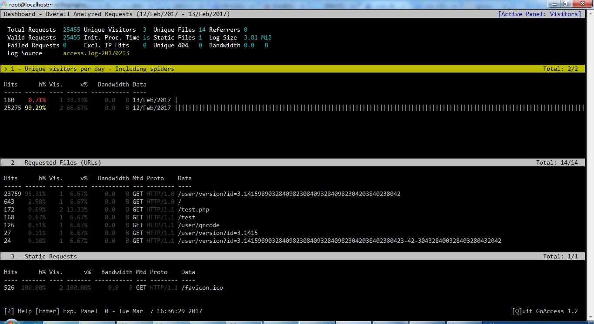
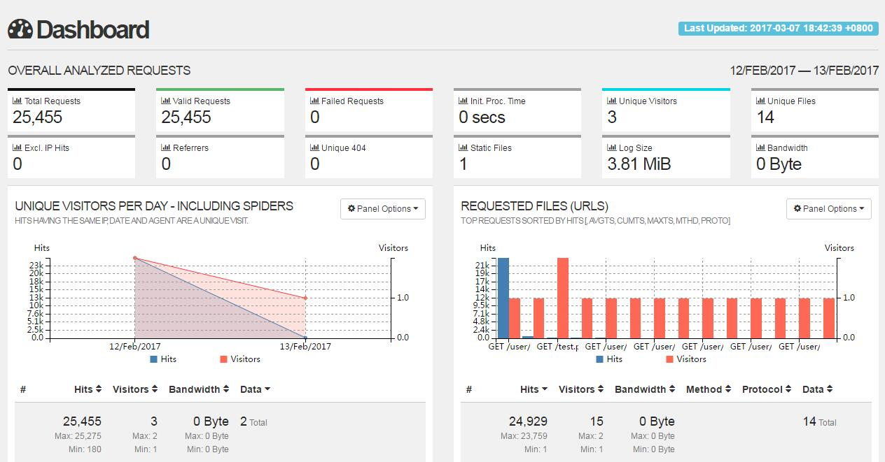

# GoAccess 安装教程

GoAccess 是一个用来分析 Web 服务器日志的工具，可以对 Nginx 、Apache 的日志进行分析统计。它提供有命令行界面，并且可以生成静态HTML页面。

## GoAccess 安装方法

### 在 CentOS 下用 yum 安装 GoAccess

```
$ yum install -y goaccess
```

[yahoo]: http://yahoo.com

> fwjeofjewof

### 用 GoAccess 源码编译安装

编译安装之前需要安装 geoip 开发包，下载地址 https://github.com/maxmind/geoip-api-c 如果不需要 geoip 功能，去掉 `--enable-geoip=legacy` 参数即可。

```
$ wget http://tar.goaccess.io/goaccess-1.2.tar.gz
$ tar -xzvf goaccess-1.2.tar.gz
$ cd goaccess-1.2/
$ ./configure --enable-utf8 --enable-geoip=legacy
$ make
$ make install
```

### 使用 GoAccess 命令行界面

```
$ goaccess /var/log/nginx/access.log
```

启动 GoAccess 然后选择 "Common Log Format (CLF)" 通用格式，运行界面如下



### 使用 GoAccess 生成 HTML 页面

GoAccess 可以将日志分析报告生成静态 HTML 页面以供展示，在使用 GoAccess 生成 HTML 页面之前，需要修改 GoAccess 的配置文件来指定日志格式，注意日志的格式需要根据情况而定

```
$ emacs /etc/goaccess.conf
time-format %H:%M:%S
date-format %d/%b/%Y
log-format %h %^[%d:%t %^] "%r" %s %b
```

使用 GoAccess 生成静态 HTML 页面

```
$ goaccess -a -d -f /var/log/nginx/access.log -o report.html
```

使用 GoAccess 生成的静态 HTML 页面如下



----------------------------------------------------------------------------

By typefo typefo@qq.com Update: 2017-04-20 本文档使用 CC-BY 4.0 协议 
