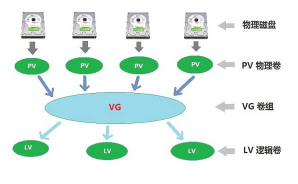

# LVM 磁盘逻辑卷

 LVM 是 Linux 虚拟逻辑卷管理工具，也就是将多个物理磁盘(PV)进行合并变成一块新的大硬盘(VG)，然后可以在这个大硬盘上再进行分区 挂载使用，新的磁盘分区(LV)就有了一个特性，那就是可以对其进行动态扩容。LVM 中有三个概念一定要清楚: **PV** 表示物理卷， **VG** 表示逻辑卷组， **LV** 表示逻辑卷，而 **LV** 逻辑卷就是我们最终可以用来挂载使用的磁盘。
  
 
  
 **LVM 主要有三类命令行工具**

`pv` 开头的命令用来操作 PV 物理卷
`vg` 开头的命令用来操作 VG 逻辑卷组
`lv` 开头的命令用来操作 LV 逻辑卷
    
## 基本 LVM 逻辑卷创建
  
- 操作系统： CentOS 7
- 硬盘1:    /dev/sdb
- 硬盘2:    /dev/sdc
   
   
如果系统没有安装 lvm 工具，可以使用下面命令进行安装

```
$ yum install -y lvm2*
```
 
**添加新硬盘并设置分区类型为 8E**

```
$ cfdisk /dev/sdb
$ cfdisk /dev/sdc
$ partprobe
```

将两块新的硬盘分别进行分区，并且将分区类型设置为 8E ，也就是 Linux LVM 分区类型，然后执行 partprobe 命令更新硬盘分区信息

**创建物理卷 (PV)**

```
$ pvcreate /dev/sdb1
$ pvcreate /dev/sdc1
```
   
将 /dev/sdb1 和 /dev/sdc1 两块物理磁盘转换成 PV 物理卷，然后查看 PV 物理卷相关信息

```
$ pvdisplay
$ pvs
$ pvscan
```   
   
**创建 VG 卷组 (VG)**

```
$ vgcreate -s 64M vg0 /dev/sdb1 /dev/sdc1
$ vgdisplay
```
   
创建新的 VG 卷组的名称为 vg0，由 /dev/sdb1 和 /dev/sdc1 两块物理卷组成，`-s` 参数表示 PE 块的大小，一般设置为 2 的倍数即可
   
**创建 LV 逻辑卷 (LV)**

```
$ lvcreate -n lv0 -L 10G vg0
$ lvdisplay
```

从 vg0 卷组创建一个名称为 lv0 的逻辑卷，分配其大小为 10GB

**格式化和挂载新的 LV 逻辑卷磁盘**

```
$ mkfs.xfs /dev/vg0/lv0
$ mkdir /var/data
$ mount /dev/vg0/lv0 /var/data
$ df -h
```
   
在 /etc/fstab 配置文件中添加开机自动挂载项

```
$ emacs /etc/fstab
/dev/mapper/vg0-lv0    /var/data   xfs  defaults      0 0
```

## 高级 LVM 逻辑卷管理

**将新硬盘加入 LVM 卷组**

为新硬盘进行分区，并设置分区类型为 8E

```
$ cfdisk /dev/sdd
$ partprobe
```    

创建物理卷

```
$ pvcreate /dev/sdd1
$ pvdisplay
```

将新的 PV 物理卷加入到 VG 卷组

```
$ vgextend vg0 /dev/sdd1
$ vgdisplay
```

**LV 逻辑卷动态扩容**

```
$ umount /dev/vg0/lv0
$ lvresize -L +2G -r /dev/vg0/lv0
$ lvdisplay
$ mount /dev/vg0/lv0 /var/data
$ df -h
```

lvresize 命令的 `-L` 参数表示在原来磁盘大小的基础上再增加 2G 的容量。
lvresize 命令的 `-r` 参数表示当完成扩容后自动更新文件系统相关信息。
   
如果 lvresize 命令没有使用 `-r` 参数，在操作系统里面看到的磁盘大小就会和扩容之后的大小不一致，可以使用 xfs_growfs 命令让内核系统重新读取磁盘信息。
   
**使用 xfs_growfs 命令更新磁盘分区信息**

```
$ xfs_growfs /dev/vg0/lv0
```

**删除 LV 逻辑卷**

```
$ umount /var/data
$ lvremove /dev/vg0/lv0
```

> 在删除 LV 逻辑卷磁盘之前一定要备份其中的数据，然后 umount 卸载掉该逻辑卷

**删除 VG 卷组**

```
$ vgremove vg0
```

> 在删除 VG 逻辑卷组之前一定要先卸载掉 LV 逻辑卷

**删除 PV 物理卷**

```
$ pvremove /dev/sdb1
```

**从 VG 卷组中删除 PV 物理卷**

```
$ vgreduce vg0 /dev/sdb1
```

**停用或者激活 VG 逻辑卷组**

停用 vg0 逻辑卷组

```
$ vgchange -an vg0
```
   
激活 vg0 逻辑卷组

```
$ vgchange -ay vg0
```

查看 VG 逻辑卷组状态

```
$ vgs
```

**停用或者激活 LV 逻辑卷**

停用 /dev/vg0/lv0 逻辑卷

```
$ lvchange -an /dev/vg0/lv0
```

激活 /dev/vg0/lv0 逻辑卷

```
$ lvchange -ay /dev/vg0/lv0
```

查看 LV 逻辑卷状态

```
$ lvs
```

## LVM 故障处理与常见问题

**LVM 物理磁盘发生故障无法识别**

比如当前系统有一个 vg0 逻辑卷组，这个 vg0 卷组中有两块物理卷 sdb1 和 sdc1 ，有一天有一块硬盘损坏无法识别，首先要进入系统恢复模式进行如下操作。

1. 使用 pvscan 命令扫描所有 PV 物理卷

```
$ pvscan
WARNING: Device for PV zIHQ8a-YIrM-uXQZ-zYIf-LqxG-yJxc-z2y5QX not found or rejected by a filter.
PV /dev/sdb1  VG vg0              lvm2 [7.94 GiB / 0 free]
PV [unknown]  VG vg0              lvm2 [7.94 GiB / 5.88 GiB free]
Total: 2 [15.88 GiB] / in use: 2 [15.88 GiB] / in no VG: 0 [0  ]
```

发现第 1 行有一条警告： 有一个 UUID 为 zIHQ8a-YIrM-uXQZ-zYIf-LqxG-yJxc-z2y5QX 的 PV 物理卷丢失，第 3 行表示我们的 PV 物理卷 /dev/sdc1 损坏并且无法识别，所以显示 unknown

2. 使用 LVM 提供的 vgreduce 命令从 vg0 卷组中删除所有无法识别的物理卷

```
$ vgreduce --removemissing --force vg0
```

`--removemissing` 表示删除 vg0 卷组中所有无法识别丢失的物理卷
`--force`         表示强制删除

3. 使用 vgscan 查看 LV 卷组状态

```
$ vgscan
Reading volume groups from cache.
Found volume group "vg0" using metadata type lvm2
```

4. 使用 pvscan 查看 PV 物理卷状态

```
$ pvscan
PV /dev/sdb1  VG vg0           lvm2 [7.94 GiB / 7.94 Gib free]
Total: 1 [7.94 GiB] / in use: 1 [7.94 GiB] / in no VG: 0 [0  ]
```

## LVM 逻辑卷相关总结

虽然 LVM 有一些特性和优点，但也有一些坑，那就是当某一块物理磁盘损坏，会导致整个 LV 逻辑卷数据丢失，数据恢复比较困难，所以一般建议在使用 LVM 逻辑卷之前，先在底层做 raid 磁盘镜像阵列。也有人测试过，一些数据库服务器软件在 LVM 磁盘上有性能下降的问题。还有就是经常备份 LVM 的相关配置文件，也就是 /etc/lvm/backup 目录下的内容。

----------------------------------------------------------------------------------------

By typefo typefo@qq.com Update: 2017-04-30 本文档使用 CC-BY 4.0 协议 
