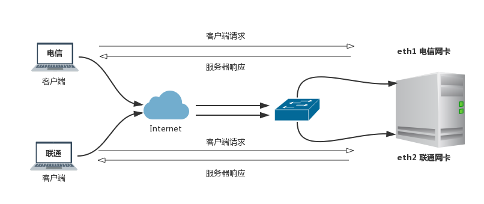

# Linux 多网关配置

Linux 多网关应用场景，比如，机房服务器有 3 块网卡，eth0 为内网IP，eth1 为电信公网IP，eth2 为联通公网IP，一般情况下服务器只能配置一个默认网关，外网客户端只能通过其中一个公网IP访问服务器，通过配置 Linux 原路返回路由功能，来实现客户端从哪个网卡进来就从哪个网卡出去。也就是电信用户访问服务器的电信公网 IP 然后从电信网卡原路返回，联通用户访问联通公网 IP 然后从联通网卡返回，服务器本身就可以通过默认的内网网关访问外网。



## 配置 Linux 多网关
   
- eth0 内网网卡，IP 地址 192.168.1.100， 网关 192.168.1.1
- eth1 电信网卡，IP 地址 114.216.29.65，网关 114.216.29.1
- eth2 联通网卡，IP 地址 60.30.128.15，网关 60.30.128.1

**配置内网 IP 地址和默认网关**

```
$ ip link set eth0 up
$ ip addr add 192.168.1.100/24 dev eth0
$ ip route add default via 192.168.1.1
```

**配置电信和联通网卡 IP 地址**

```
$ ip link set eth1 up
$ ip addr add 114.216.29.65/24 dev eth1
$ ip link set eth2 up
$ ip addr add 60.30.128.15/24 dev eth2
```

**添加电信和联通两个路由表**

```
$ emacs /etc/iproute2/rt_tables
251 tel
252 cnc
```

编辑 /etc/iproute2/rt_tables 配置文件，添加两个编号 251 和 252 的路由表条目，tel 为电信 cnc 为联通

**配置电信和联通的原路路由**

```
$ ip route flush table tel
$ ip route add default via 114.216.29.1 dev eth1 src 114.216.29.65 table tel
$ ip rule add from 114.216.29.65 table tel
$ ip route flush table cnc
$ ip route add default via 60.30.128.1 dev eth1 src 60.30.128.15 table cnc
$ ip rule add from 60.30.128.15 table cnc
```

以上就基本配置好了电信和联通的多线原路返回路由

----------------------------------------------------------------------------------------

By typefo typefo@qq.com Update: 2017-04-29 本文档使用 CC-BY 4.0 协议 
