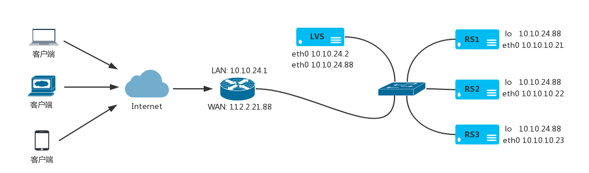

# LVS DR 模式

在 LVS 的 DR 模式下通过改写请求报文的MAC地址，将请求发送到真实服务器，而真实服务器将响应直接返回给客户。同 TUN 模式一样，DR模式可极大地提高集群系统的伸缩性。这种方法没有IP隧道的开销，对集群中的真实服务器也没有必须支持IP隧道协议的要求，但是要求调度器与真实服务器都有一块网卡连在同一物理网段上。

## LVS 的 DR 模式部署

DR 模式下，请求流量经过 LVS，后端服务器直接响应客户端。前端一台路由器，只有一个公网IP，所有服务器只有一块网卡。
   

   
- 公网IP地址 112.2.21.88 内网 VIP 地址 10.10.24.88
- 路由器配置 WAN: 112.2.21.88 LAN: 10.10.24.1
- LVS服务器 eth0: 10.10.24.10 和 10.10.24.88
- RS1服务器 lo: 10.10.24.88 eth0: 10.10.24.21
- RS2服务器 lo: 10.10.24.88 eth0: 10.10.24.22
- RS3服务器 lo: 10.10.24.88 eth0: 10.10.24.23
     
**前端路由器配置**
   
将公网 IP 地址映射到内网 VIP 地址。所有服务器默认网关为 10.10.24.1。以思科路由器为例添加 IP 映射。
   
```
Router> enable
Router# configure terminal
Router(config)# ip nat inside source static 10.10.24.88 112.2.21.88
Router(config)# end
```
   
如果不需要前端路由器，也就是 LVS 直接放在公网上，可以不需要配置路由器，只需要将内网 VIP 地址修改为公网 IP 地址即可

**LVS 服务器配置**
   
配置网卡 IP 地址
   
```
$ ip link set eth0 up
$ ip addr add 10.10.24.10/24 dev eth0
$ ip addr add 10.10.24.88/32 broadcast 10.10.24.88 dev eth0
$ ip route add default via 10.10.24.1
```
   
配置 LVS 负载均衡，添加 3 台后端服务器节点
   
```
$ ipvsadm -A -t 10.10.24.88:80 -s rr
$ ipvsadm -a -t 10.10.24.88:80 -r 10.10.24.21 -g
$ ipvsadm -a -t 10.10.24.88:80 -r 10.10.24.22 -g
$ ipvsadm -a -t 10.10.24.88:80 -r 10.10.24.23 -g
$ ipvsadm -ln
```
   
   
**RS1 服务器配置**
   
```
$ echo 1 > /proc/sys/net/ipv4/conf/lo/arp_ignore
$ echo 1 > /proc/sys/net/ipv4/conf/all/arp_ignore
$ echo 2 > /proc/sys/net/ipv4/conf/lo/arp_announce
$ echo 2 > /proc/sys/net/ipv4/conf/all/arp_announce
$ ip link set eth0 up
$ ip addr add 10.10.24.21/24 dev eth0
$ ip addr add 10.10.24.88/32 broadcast 10.10.24.88 dev lo
$ ip route add default via 10.10.24.1
```
   
**RS2 服务器配置**
   
```
$ echo 1 > /proc/sys/net/ipv4/conf/lo/arp_ignore
$ echo 1 > /proc/sys/net/ipv4/conf/all/arp_ignore
$ echo 2 > /proc/sys/net/ipv4/conf/lo/arp_announce
$ echo 2 > /proc/sys/net/ipv4/conf/all/arp_announce
$ ip link set eth0 up
$ ip addr add 10.10.24.22/24 dev eth0
$ ip addr add 10.10.24.88/32 broadcast 10.10.24.88 dev lo
$ ip route add default via 10.10.24.1
```
   
**RS3 服务器配置**
   
```
$ echo 1 > /proc/sys/net/ipv4/conf/lo/arp_ignore
$ echo 1 > /proc/sys/net/ipv4/conf/all/arp_ignore
$ echo 2 > /proc/sys/net/ipv4/conf/lo/arp_announce
$ echo 2 > /proc/sys/net/ipv4/conf/all/arp_announce
$ ip link set eth0 up
$ ip addr add 10.10.24.23/24 dev eth0
$ ip addr add 10.10.24.88/32 broadcast 10.10.24.88 dev lo
$ ip route add default via 10.10.24.1
```
