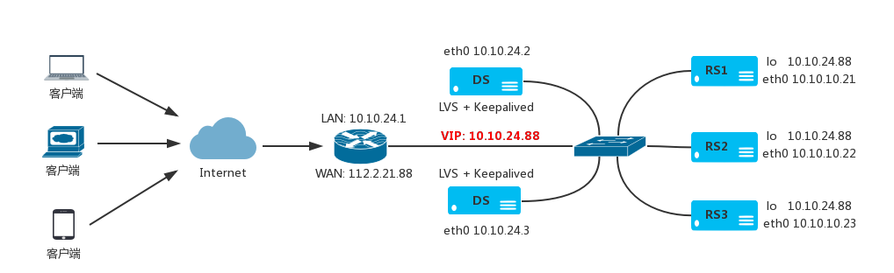

# LVS 与 Keepalived 高可用

Keepalived 是一种利用 VRRP 协议来实现双机热备高可用的软件方案，它可以工作在第 3、4、和第 7 层网络上。 Keepalived 使用一台 master 主服务器和一台 backup 备份服务器做冗余来实现高可用，当某一台宕机，另外一台会立即抢占 VIP 地址，继续对外提供服务。
   

   
## LVS 与Keepalived 配置部署

master 和 backup 服务器的 LVS 超时时间设置

```
$ ipvsadm --set 45 15 60
```

`在 master 和 backup 服务器上安装 Keepalived 软件包
   
```
$ yum install -y keepalived
```
   
安装后的 keepalived 配置文件位置(其中一个路径)

```
/etc/keepalived/keepalived.conf
/usr/local/etc/keepalived/keepalived.conf
```

**配置 master 主服务器**

master 主机 keepalived 配置文件

```
global_defs {
  notification_email {
    acassen@firewall.loc
  }
   
  notification_email_from Alexandre.Cassen@firewall.loc
  smtp_server 127.0.0.1
  smtp_connect_timeout 30
  router_id LVS_MASTER
  vrrp_skip_check_adv_addr
  vrrp_garp_interval 0
  vrrp_gna_interval 0
}
   
vrrp_instance VI_1 {
  state MASTER
  interface eth0
  virtual_router_id 51
  priority 100
  advert_int 1
   
  authentication {
    auth_type PASS
    auth_pass 1111
  }
   
  virtual_ipaddress {
    10.10.24.88/32 brd 10.10.24.88 dev eth0
  }
}
   
virtual_server 10.10.24.88 80 {
  delay_loop 6
  lb_algo rr
  lb_kind DR
  persistence_timeout 65
  protocol TCP
  sorry_server 10.10.24.254 80
   
  real_server 10.10.24.21 80 {
    weight 1

    HTTP_GET {
      url {
        path /check.html
        digest eff5bc1ef8ec9d03e640fc4370f5eacd
      }
   
      connect_port 80
        connect_timeout 3
        nb_get_retry 3
        delay_before_retry 3
    }
  }
   
  real_server 10.10.24.22 80 {
    weight 1
   
    HTTP_GET {
      url {
        path /check.html
        digest eff5bc1ef8ec9d03e640fc4370f5eacd
      }
   
      connect_port 80
      connect_timeout 3
      nb_get_retry 3
      delay_before_retry 3
    }
  }

  real_server 10.10.24.23 80 {
    weight 1
   
    HTTP_GET {
      url {
        path /check.html
        digest eff5bc1ef8ec9d03e640fc4370f5eacd
      }
   
      connect_port 80
      connect_timeout 3
      nb_get_retry 3
      delay_before_retry 3
    }
  }
}
```
  
**配置 backup 备份服务器**

backup 主机 keepalived 配置文件

```
global_defs {
  notification_email {
    acassen@firewall.loc
  }
   
  notification_email_from Alexandre.Cassen@firewall.loc
  smtp_server 127.0.0.1
  smtp_connect_timeout 30
  router_id LVS_BACKUP
  vrrp_skip_check_adv_addr
  vrrp_garp_interval 0
  vrrp_gna_interval 0
}
   
vrrp_instance VI_1 {
  state BACKUP
  interface eth0
  virtual_router_id 51
  priority 80
  advert_int 1
   
  authentication {
    auth_type PASS
    auth_pass 1111
  }
   
  virtual_ipaddress {
      10.10.24.88/32 brd 10.10.24.88 dev eth0
  }
}
   
virtual_server 10.10.24.88 80 {
  delay_loop 6
  lb_algo rr
  lb_kind DR
  persistence_timeout 65
  protocol TCP
  sorry_server 10.10.24.254 80
   
  real_server 10.10.24.21 80 {
    weight 1
   
    HTTP_GET {
      url {
        path /check.html
        digest eff5bc1ef8ec9d03e640fc4370f5eacd
      }
   
      connect_port 80
      connect_timeout 3
      nb_get_retry 3
      delay_before_retry 3
    }
  }
   
  real_server 10.10.24.22 80 {
    weight 1
   
    HTTP_GET {
      url {
        path /check.html
        digest eff5bc1ef8ec9d03e640fc4370f5eacd
      }
   
      connect_port 80
      connect_timeout 3
      nb_get_retry 3
      delay_before_retry 3
    }
  }

  real_server 10.10.24.23 80 {
    weight 1
   
    HTTP_GET {
      url {
        path /check.html
        digest eff5bc1ef8ec9d03e640fc4370f5eacd
      }
   
      connect_port 80
      connect_timeout 3
      nb_get_retry 3
      delay_before_retry 3
    }
  }
}   
```

**配置后端 realserver 服务器 Web 健康检测文件**

在所有后端服务器 Web 根目录下添加 check.html 文件，内容为

```
ok
```

----------------------------------------------------------------------------------------

By typefo typefo@qq.com Update: 2017-04-29 本文档使用 CC-BY 4.0 协议 
