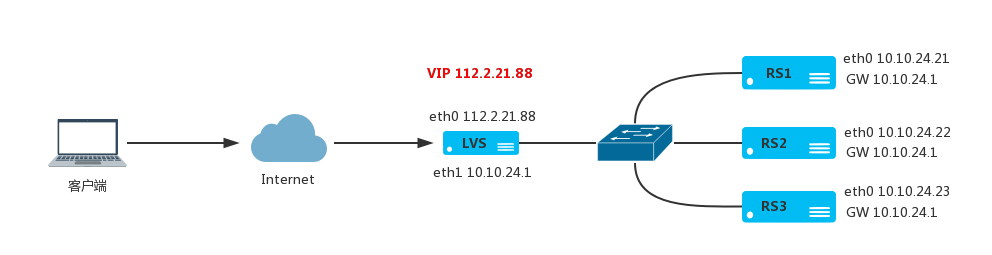

# LVS NAT 工作模式
     
通过网络地址转换，调度器重写请求报文的目标地址，根据预设的调度算法，将请求分派给后端的真实服务器，真实服务器的响应报文通过调度器时，报文的源地址被重写，再返回给客户，完成整个负载调度过程。

## LVS 的 NAT 模式部署

NAT 工作模式下请求和响应流量都经过 LVS 服务器，LVS 服务器有内网和外网两块网卡，VIP 配置在外网卡上，



- LVS服务器: eth0 112.2.21.88，eth1 10.10.24.1，网关 112.2.21.1
- RS1服务器: eth0 10.10.24.21 网关 10.10.24.1
- RS2服务器: eth0 10.10.24.22 网关 10.10.24.1
- RS3服务器: eth0 10.10.24.23 网关 10.10.24.1

**配置 LVS 服务器**

开启网卡间路由转发

```
$ echo 1 > /proc/sys/net/ipv4/ip_forward
```

配置内网和外网 IP 地址

```
$ ip link set eth0 up
$ ip addr add 112.2.21.88/30 dev eth0
$ ip route add default via 112.2.21.1
$ ip link set eth1 up
$ ip addr add 10.10.24.1/24 dev eth1
```

添加 LVS 虚拟服务器和后端节点

```
$ ipvsadm -A -t 112.2.21.88:80 -s rr
$ ipvsadm -a -t 112.2.21.88:80 -r 10.10.24.21:80 -m
$ ipvsadm -a -t 112.2.21.88:80 -r 10.10.24.22:80 -m
$ ipvsadm -a -t 112.2.21.88:80 -r 10.10.24.23:80 -m
```

查看配置结果

```
$ ipvsadm -ln
```

**配置 RS1 服务器**

```
$ ip link set eth0 up
$ ip addr add 10.10.24.21/24 dev eth0
$ ip route add default via 10.10.24.1
```

**配置 RS2 服务器**

```
$ ip link set eth0 up
$ ip addr add 10.10.24.22/24 dev eth0
$ ip route add default via 10.10.24.1
```

**配置 RS3 服务器**

```
$ ip link set eth0 up
$ ip addr add 10.10.24.23/24 dev eth0
$ ip route add default via 10.10.24.1
```

----------------------------------------------------------------------------------------

By typefo typefo@qq.com Update: 2017-04-29 本文档使用 CC-BY 4.0 协议 
