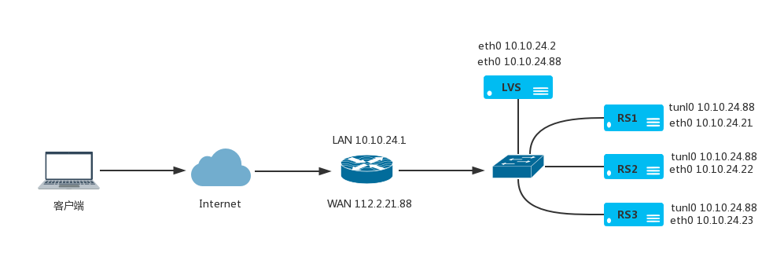

# LVS TUN 模式

采用NAT技术时，由于请求和响应报文都必须经过调度器地址重写，当客户请求越来越多时，调度器的处理能力将成为瓶颈。为了解决这个问题，调度器把请求报文通过IP隧道转发至真实服务器，而真实服务器将响应直接返回给客户，所以调度器只处理请求报文。由于一般网络服务应答比请求报文大许多，采用 TUN 技术后，集群系统的最大吞吐量可以提高10倍。

## LVS TUN 模式部署

在 TUN 工作模式下，所有请求经过 LVS ，后端服务器直接响应客户端，与 DR 模式类似。所有服务器只有一块网卡。



- 公网IP 112.2.21.88，内网 VIP 10.10.24.88
- 路由器 WAN： 112.2.21.88，LAN： 10.10.24.1
- LVS : eth0 10.10.24.2 和 10.10.24.88
- RS1 : eth0 10.10.24.21，tunl0 10.10.24.88
- RS2 : eth0 10.10.24.22，tunl0 10.10.24.88
- RS3 : eth0 10.10.24.22，tunl0 10.10.24.88

**前端路由器配置**
   
将公网 IP 地址映射到内网 VIP 地址。所有服务器默认网关为 10.10.24.1。以思科路由器为例添加 IP 映射。
   
```
Router> enable
Router# configure terminal
Router(config)# ip nat inside source static 10.10.24.88 112.2.21.88
Router(config)# end
```
   
如果不需要前端路由器，也就是 LVS 直接放在公网上，可以不需要配置路由器，只需要将内网 VIP 地址修改为公网 IP 地址即可

**LVS服务器配置**

加载 ipip 内核模块

```
$ modprobe ipip
```

配置内网IP地址和VIP地址

```
$ ip link set tunl0 up
$ ip link set eth0 up
$ ip addr add 10.10.24.2/24 dev eth0
$ ip addr add 10.10.24.88/32 broadcast 10.10.24.88 dev eth0
$ ip route add default via 192.168.1.1
```

配置一些内核参数

```
echo 0 > /proc/sys/net/ipv4/ip_forward
echo 1 > /proc/sys/net/ipv4/conf/all/send_redirects
echo 1 > /proc/sys/net/ipv4/conf/default/send_redirects
echo 1 > /proc/sys/net/ipv4/conf/eth0/send_redirects
```

添加 LVS 虚拟服务器和后端节点

```
$ ipvsadm -A -t 10.10.24.88:80 -s rr
$ ipvsadm -a -t 10.10.24.88:80 -r 10.10.24.21:80 -i
$ ipvsadm -a -t 10.10.24.88:80 -r 10.10.24.22:80 -i
$ ipvsadm -a -t 10.10.24.88:80 -r 10.10.24.23:80 -i
$ ipvsadm -ln
```

**RS1服务器配置**

```
$ modprobe ipip
$ ip link set tunl0 up
$ ip link set eth0 up
$ echo 0 > /proc/sys/net/ipv4/ip_forward
$ echo 1 > /proc/sys/net/ipv4/conf/tunl0/arp_ignore
$ echo 1 > /proc/sys/net/ipv4/conf/all/arp_ignore
$ echo 2 > /proc/sys/net/ipv4/conf/tunl0/arp_announce
$ echo 2 > /proc/sys/net/ipv4/conf/all/arp_announce
$ echo 0 > /proc/sys/net/ipv4/conf/tunl0/rp_filter
$ echo 0 > /proc/sys/net/ipv4/conf/all/rp_filter
$ ip addr add 10.10.24.88/32 broadcast 10.10.24.88 dev tunl0
$ ip addr add 10.10.24.21/24 dev eth0
$ ip route add 10.10.24.88/32 dev tunl0
$ ip route add default via 10.10.24.1
```

**RS2服务器配置**

```
$ modprobe ipip
$ ip link set tunl0 up
$ ip link set eth0 up
$ echo 0 > /proc/sys/net/ipv4/ip_forward
$ echo 1 > /proc/sys/net/ipv4/conf/tunl0/arp_ignore
$ echo 1 > /proc/sys/net/ipv4/conf/all/arp_ignore
$ echo 2 > /proc/sys/net/ipv4/conf/tunl0/arp_announce
$ echo 2 > /proc/sys/net/ipv4/conf/all/arp_announce
$ echo 0 > /proc/sys/net/ipv4/conf/tunl0/rp_filter
$ echo 0 > /proc/sys/net/ipv4/conf/all/rp_filter
$ ip addr add 10.10.24.88/32 broadcast 10.10.24.88 dev tunl0
$ ip addr add 10.10.24.22/24 dev eth0
$ ip route add 10.10.24.88/32 dev tunl0
$ ip route add default via 10.10.24.1
```

**RS3服务器配置**

```
$ modprobe ipip
$ ip link set tunl0 up
$ ip link set eth0 up
$ echo 0 > /proc/sys/net/ipv4/ip_forward
$ echo 1 > /proc/sys/net/ipv4/conf/tunl0/arp_ignore
$ echo 1 > /proc/sys/net/ipv4/conf/all/arp_ignore
$ echo 2 > /proc/sys/net/ipv4/conf/tunl0/arp_announce
$ echo 2 > /proc/sys/net/ipv4/conf/all/arp_announce
$ echo 0 > /proc/sys/net/ipv4/conf/tunl0/rp_filter
$ echo 0 > /proc/sys/net/ipv4/conf/all/rp_filter
$ ip addr add 10.10.24.88/32 broadcast 10.10.24.88 dev tunl0
$ ip addr add 10.10.24.23/24 dev eth0
$ ip route add 10.10.24.88/32 dev tunl0
$ ip route add default via 10.10.24.1
```
